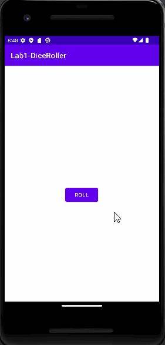

# Dice Roller App
This folder contains the source code for the Dice Roller app codelab.

# Introduction
In this codelab, we will create a Dice Roller Android app where users can click a Button in the app
to roll a dice. The outcome of the roll will be shown in a TextView on the screen.

# Pre-requisites
1. How to create and run a "Hello, World!" app in Android Studio.
2. Familiar with using TextViews in an app.
3. How to modify the attributes of a TextView in the Layout Editor.
4. How to extract text into a string resource to make it easier to translate your app and reuse strings.
5. Kotlin programming basics

Final gifs
---------------
Lab1:
